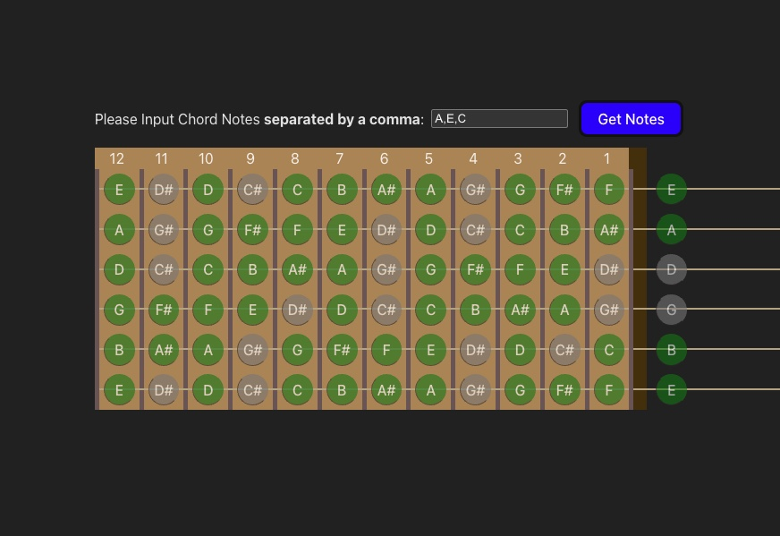

# 🎸 Valid Notes

**Valid Notes** is a React + TypeScript application that helps users visualize and interact with musical notes and scales on a guitar fret board. The app dynamically calculates valid notes based on user-inputted chords and provides a visual representation of the fret board, along with audio playback for individual notes.

---

## 🚀 Features

- 🎼 **Dynamic Chord Validation**: Input chords to calculate and display valid notes on the fret board.
- 🎸 **Interactive Fret board**: Visualize valid notes on a guitar fret board with dynamic highlighting.
- 🔊 **Audio Playback**: Play individual notes using the Web Audio API and `soundfont-player`.
- ⚡ **Built with Vite**: Fast development environment with hot module replacement (HMR).
- 🛠️ **TypeScript Support**: Strongly typed codebase for better maintainability and developer experience.

---

## 🖼️ Screenshots


_Example of the fret board with valid notes highlighted._

---

## 🛠️ Technologies Used

- **Frontend**: React, TypeScript
- **State Management**: React Hooks (`useState`, `useEffect`, `useCallback`, `useTransition`)
- **Audio**: `soundfont-player` for note playback
- **Styling**: CSS
- **Build Tool**: Vite
- **Firebase**: For hosting and potential backend integration (e.g., authentication, database)

---

## 📂 Project Structure

```
valid-notes/
├── src/
│   ├── components/       # React components (e.g., ChordForm, FretBoard, Note)
│   ├── classes/          # Core classes (e.g., MusicalLinkedList, MusicalScale)
│   ├── hooks/            # Custom React hooks (e.g., useValidNotes)
│   ├── utils/            # Utility functions (e.g., playGuitarNote, generateAllScales)
│   ├── constants/        # Constants for musical notes and scales
│   ├── App.tsx           # Main application component
│   └── main.tsx          # Entry point for the React app
├── public/               # Static assets
├── package.json          # Project dependencies and scripts
└── README.md             # Project documentation
```

---

## 🛠️ Installation and Setup

Follow these steps to run the project locally:

### Prerequisites

- Node.js (v16 or later)
- npm or yarn

### Steps

1. **Clone the Repository**:

   ```bash
   git clone https://github.com/your-username/valid-notes.git
   cd valid-notes
   ```

2. **Install Dependencies**:

   ```bash
   npm install
   ```

3. **Start the Development Server**:

   ```bash
   npm run dev
   ```

4. **Open in Browser**:
   - Visit `http://localhost:5173` to view the app.

---

## 📖 Usage

1. **Input Chords**:

   - Enter chord notes (e.g., `C,E,G`) in the input field.
   - The app validates the input and calculates valid notes.

2. **Visualize Notes**:

   - The fret board highlights valid notes based on the inputted chord.

3. **Play Notes**:
   - Click on any note on the fret board to hear its sound.

---

## 📚 Documentation

### Key Components

- **`ChordForm`**:
  - Handles user input for chords and validates the format.
- **`FretBoard`**:
  - Displays the guitar fret board and highlights valid notes.
- **`Note`**:
  - Represents a single note on the fret board, with audio playback functionality.

### Key Hooks

- **`useValidNotes`**:
  - Custom hook for managing chord state and calculating valid notes.

### Utility Functions

- **`playGuitarNote(note: string)`**:
  - Plays a guitar note using the Web Audio API.
- **`generateAllScales()`**:
  - Generates all possible major scales based on musical notes.

---

## 🌟 Features to Add (Future Work)

- 🎵 **Support for Minor Scales**: Extend functionality to include minor and custom scales.
- 🎤 **User Authentication**: Allow users to save and load their favorite chords.
- 📊 **Analytics**: Track popular chords and scales.
- 🎨 **Theming**: Add light/dark mode support.

---

## 🤝 Contributing

Contributions are welcome! To contribute:

1. Fork the repository.
2. Create a new branch:
   ```bash
   git checkout -b feature-name
   ```
3. Commit your changes:
   ```bash
   git commit -m "Add feature-name"
   ```
4. Push to your branch:
   ```bash
   git push origin feature-name
   ```
5. Open a pull request.

---

---

## 🙌 Acknowledgments

- [Soundfont Player](https://github.com/danigb/soundfont-player) for audio playback.
- [React Hook Form](https://react-hook-form.com/) for form handling.
- [Vite](https://vitejs.dev/) for the fast development environment.

---

## 📧 Contact

For questions or feedback, feel free to reach out:

- **Email**: shimonfiller@example.com
